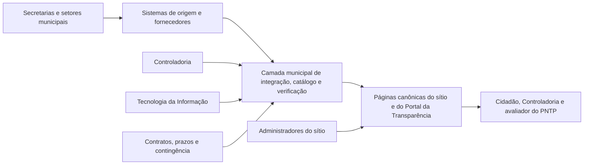

# Etapa 1 - Requisitos essenciais do PNTP 2026 para o portal de Amargosa

> **Tipo de documento:** especificação normativa e contexto de implementação  
> **Leitor principal:** IA ou equipe responsável por projetar, implementar, testar e auditar o novo portal  
> **Escopo:** requisitos essenciais de elegibilidade às medalhas do PNTP 2026  
> **Regra principal:** nenhum recurso poderá ser considerado pronto apenas por existir visualmente; deverá funcionar de ponta a ponta e produzir evidência verificável

## Como a IA deverá usar este documento

Este arquivo não é apenas um relatório de pesquisa. Ele deverá ser usado como **fonte obrigatória de requisitos** quando o novo sítio institucional e o Portal da Transparência forem planejados, implementados, revisados ou migrados.

Ao receber este documento como contexto, a IA responsável pelo projeto deverá:

1. lê-lo integralmente antes de propor estrutura, banco de dados, componentes, integrações ou código;
2. tratar todas as expressões **“deverá”**, **“não poderá”**, **“obrigatório”** e **“requisito mínimo”** como condições de aceitação;
3. transformar cada requisito aplicável em funcionalidade, regra de dados, controle administrativo e teste verificável;
4. relacionar cada um dos 12 critérios essenciais à sua página canônica, fonte de dados, responsável, integração, histórico, filtros, download e evidência;
5. preservar as regras deste arquivo ao aplicar as decisões técnicas definidas na Etapa 2;
6. usar as referências visuais estudadas na Etapa 3 apenas como inspiração, sem copiar soluções que contrariem o PNTP, a acessibilidade ou este documento;
7. aplicar posteriormente a checklist da Etapa 4 para ampliar a pontuação, sem reduzir ou substituir nenhum requisito essencial;
8. verificar novamente as fontes oficiais vigentes antes da implementação e da entrega, registrando qualquer alteração metodológica encontrada;
9. declarar explicitamente qualquer requisito que dependa de informação, contrato, acesso ou decisão ainda não fornecida pela Prefeitura;
10. implementar e testar os requisitos confirmados, sem inventar dados públicos nem marcar como atendido aquilo que ainda não pôde ser comprovado.

### Ordem de autoridade e interpretação

Para fins de construção do portal, deverá ser aplicada a seguinte ordem:

1. legislação vigente e versão oficial mais recente da matriz e da cartilha do PNTP;
2. decisões expressas da Prefeitura e da Controladoria que não contrariem as obrigações legais;
3. requisitos normativos deste documento;
4. arquitetura e controles técnicos definidos na Etapa 2;
5. referências de experiência e identidade visual selecionadas na Etapa 3;
6. checklist de otimização de pontuação da Etapa 4.

Se uma fonte oficial posterior modificar um requisito, a IA não deverá aplicar silenciosamente a regra antiga. Deverá indicar a divergência, atualizar a matriz de rastreabilidade e adaptar a implementação à norma vigente.

As expressões deste documento possuem os seguintes sentidos:

- **deverá / obrigatório / requisito mínimo:** implementação indispensável;
- **não poderá:** comportamento proibido ou condição que invalida a entrega;
- **preferencialmente:** solução recomendada, substituível somente por alternativa que preserve o mesmo resultado;
- **sugerido:** orientação não vinculante que deverá ser confirmada com a Prefeitura;
- **observado:** constatação sobre o portal atual, usada como diagnóstico e não como modelo a ser copiado.

### Entregáveis que a IA deverá produzir durante a construção

Antes de iniciar a implementação, a IA deverá criar ou atualizar uma matriz de rastreabilidade contendo, no mínimo:

| Campo | Finalidade |
|---|---|
| ID do requisito | Relacionar a implementação ao critério do PNTP |
| Página ou rota | Definir onde a informação será encontrada |
| Fonte oficial | Identificar sistema, documento, API ou setor produtor |
| Estratégia de integração | Indicar API, sincronização, importação, documento local ou link monitorado |
| Componente ou módulo | Identificar onde o requisito será implementado |
| Regra administrativa | Impedir que edição ou design quebre o requisito |
| Teste de aceitação | Demonstrar o funcionamento de ponta a ponta |
| Evidência | Registrar URL e resultado verificável |
| Estado | Não iniciado, bloqueado, implementado ou validado |

Durante e depois da implementação, a IA deverá:

- manter a matriz sincronizada com o código e as decisões do projeto;
- criar testes proporcionais ao risco de cada requisito;
- distinguir claramente conteúdo real, dado de demonstração e informação ainda não fornecida;
- impedir que dados fictícios ou placeholders sejam publicados como informação oficial;
- registrar bloqueios sem preencher lacunas com suposições;
- validar o portal público sem autenticação e a área administrativa com as proteções correspondentes;
- somente declarar um essencial como validado depois que todo o respectivo teste de aceitação tiver sido executado com sucesso.

### O que este documento não autoriza

Este arquivo não autoriza a IA a:

- copiar código, conteúdo, credenciais ou fragilidades do portal atual;
- considerar páginas de exemplo ou dados simulados como cumprimento do PNTP;
- substituir uma integração necessária por um link genérico apenas para completar a interface;
- alterar o sentido de requisito legal por conveniência técnica ou visual;
- definir como atendido um critério que possua filtro, histórico, detalhe, documento ou download obrigatório sem funcionamento;
- expor dados pessoais, segredos, registros internos ou informações não destinadas à transparência pública.

## 1. Finalidade deste documento

Este documento define o conjunto mínimo de informações, funcionalidades e controles que o futuro sítio oficial e o Portal da Transparência da Prefeitura Municipal de Amargosa deverão possuir para atender a **100% dos critérios essenciais** aplicáveis ao Poder Executivo municipal no Programa Nacional de Transparência Pública (PNTP) de 2026.

Esta é uma especificação de requisitos. Ela orientará as etapas posteriores, mas **não define ainda**:

- linguagem de programação;
- framework;
- banco de dados;
- arquitetura de backend;
- infraestrutura de hospedagem;
- identidade visual;
- referências de design;
- implementação do código.

Essas decisões serão tomadas nas próximas etapas do projeto.

## 2. Fontes oficiais e data de referência

Este documento foi elaborado a partir das seguintes fontes oficiais:

- Cartilha PNTP 2026, atualizada pela Atricon em 08/04/2026: <https://radardatransparencia.atricon.org.br/pdf/Cartilha-PNTP-2026.pdf>
- Matriz de Critérios de Avaliação PNTP 2026, atualizada em 31/03/2026: <https://radardatransparencia.atricon.org.br/downloads.html>

Antes da implementação e antes de cada ciclo de autoavaliação, a Controladoria deverá confirmar se a Atricon publicou retificação, nova versão da cartilha ou nova matriz.

## 3. Condição para obtenção de medalha

O PNTP 2026 estabelece as seguintes faixas de certificação:

| Certificação | Índice de transparência | Requisito adicional |
|---|---:|---|
| Prata | 75% a 84% | 100% dos critérios essenciais |
| Ouro | 85% a 94% | 100% dos critérios essenciais |
| Diamante | 95% a 100% | 100% dos critérios essenciais |

Portanto, cumprir os requisitos deste documento é uma **condição de elegibilidade**, mas não é suficiente, isoladamente, para alcançar 75% da pontuação total. Os critérios obrigatórios e recomendados que produzem a pontuação necessária serão tratados na Etapa 4.

Se apenas um critério essencial não for atendido, a Prefeitura perde a possibilidade de receber a certificação, mesmo que a nota final seja superior a 75%.

## 4. Escopo aplicável ao Executivo municipal

A matriz aplicável à Prefeitura é formada por critérios comuns e critérios específicos do Poder Executivo. No ciclo de 2026, esse recorte possui:

- 96 critérios aplicáveis no total;
- 12 critérios essenciais;
- 65 critérios obrigatórios;
- 19 critérios recomendados.

Os 12 critérios essenciais são:

| ID | Dimensão | Critério essencial |
|---|---|---|
| 1.1 | Informações Prioritárias | Sítio oficial próprio na internet |
| 1.2 | Informações Prioritárias | Portal da Transparência próprio ou compartilhado |
| 3.1 | Receita | Receita prevista e realizada |
| 3.2 | Receita | Classificação da receita por natureza |
| 4.1 | Despesa | Totais empenhado, liquidado e pago |
| 4.2 | Despesa | Classificação orçamentária da despesa |
| 4.3 | Despesa | Consulta detalhada de empenhos |
| 11.5 | Planejamento e Prestação de Contas | Relatório de Gestão Fiscal - RGF |
| 11.6 | Planejamento e Prestação de Contas | Relatório Resumido da Execução Orçamentária - RREO |
| 11.8 | Planejamento e Prestação de Contas | Plano Plurianual - PPA |
| 11.9 | Planejamento e Prestação de Contas | Lei de Diretrizes Orçamentárias - LDO |
| 11.10 | Planejamento e Prestação de Contas | Lei Orçamentária Anual - LOA |

## 5. Regras gerais que valem para todos os critérios essenciais

### 5.1 Acesso público e sem barreiras

Toda informação deverá:

- estar disponível pela internet sem login, cadastro ou identificação prévia;
- dispensar CAPTCHA para a simples consulta de dados públicos;
- funcionar nos navegadores atuais e em dispositivos móveis;
- ser acessível por conexão comum, sem tempo de carregamento excessivo;
- permanecer disponível durante todo o período de avaliação;
- possuir alternativa de contingência quando depender de sistema terceirizado.

Se o portal ficar indisponível após tentativas em momentos e dias diferentes, o item de disponibilidade poderá ser rejeitado.

### 5.2 URL direta, permanente e registrável como evidência

Cada critério deverá possuir uma URL própria ou um endereço que leve diretamente ao conteúdo correspondente.

Não será considerada evidência suficiente:

- a página inicial da Prefeitura;
- a página inicial genérica do Portal da Transparência;
- um menu que obrigue o avaliador a procurar a informação;
- uma página que misture dados de diferentes órgãos sem abrir diretamente no recorte de Amargosa;
- um resultado acessível somente após uma sequência não reproduzível de cliques.

As URLs deverão ser estáveis. Mudanças de sistema deverão preservar redirecionamentos e o acesso ao histórico anterior.

### 5.3 Atendimento integral: regra do “tudo ou nada”

O PNTP não considera atendimento parcial do item disponibilidade. Para marcar um critério como atendido, todas as informações mínimas exigidas devem estar presentes.

Quando a disponibilidade for rejeitada, todo o critério recebe nota zero, incluindo atualidade, série histórica, download e filtros.

### 5.4 Apresentação na página

Sempre que possível, as informações deverão ser apresentadas em HTML, em tabela legível e pesquisável. Documentos oficiais poderão continuar em PDF quando essa for a forma juridicamente adequada, mas bases de receitas, despesas e empenhos não deverão depender exclusivamente de PDF.

Cada página deverá exibir:

- título inequívoco;
- órgão responsável;
- período de referência;
- data e hora da atualização real dos dados;
- explicação breve dos campos e filtros;
- contato para comunicação de erro;
- link permanente da própria página.

Uma data automática gerada no momento em que o usuário abre a página não comprova atualidade. A data precisa representar a atualização efetiva do conteúdo ou a data de referência dos dados.

#### 5.4.1 Banners, imagens com texto e campanhas

Banner será recurso de comunicação complementar e nunca poderá substituir página, tabela, documento, link ou informação exigida pelo PNTP. Nenhum critério essencial, prazo legal, acesso ao Portal da Transparência ou canal de atendimento poderá existir somente dentro de uma imagem ou slide.

Quando uma arte contiver texto incorporado, o portal deverá fornecer equivalente textual em HTML ou nome acessível que comunique título, finalidade e destino. A imagem deverá permanecer compreensível em celular, sem distorção e sem corte de informação relevante. Neste projeto, cada slide terá obrigatoriamente uma arte desktop e uma composição mobile própria; a publicação será bloqueada quando qualquer uma das duas estiver ausente. Título, resumo e ação continuarão disponíveis em HTML, pois a imagem escrita não substitui conteúdo acessível.

As seguintes situações deverão bloquear a publicação ou impedir que o banner seja usado como única evidência:

- link essencial disponível somente no banner;
- título, data, prazo ou chamada sem equivalente textual;
- corte de brasão, logomarca, texto, telefone, data ou chamada para ação;
- imagem esticada ou deformada para preencher o espaço;
- texto ilegível em viewport móvel;
- ausência de texto alternativo ou nome acessível;
- banner sem destino claro, quando funcionar como link;
- campanha vencida sem data de expiração ou retirada;
- carrossel cujo conteúdo essencial não possa ser alcançado por teclado.

### 5.5 Atualidade

Como regra geral do PNTP, os dados mais recentes não poderão possuir intervalo superior a 30 dias na data da avaliação. Os prazos específicos de RGF e RREO prevalecem quando aplicáveis.

Para receitas e despesas, o limite metodológico de 30 dias não substitui a obrigação legal de transparência em tempo real do Siafic. Os registros contábeis devem ser disponibilizados até o primeiro dia útil subsequente ao registro, conforme o Decreto nº 10.540/2020.

### 5.6 Série histórica

Quando a matriz exigir série histórica, deverão estar disponíveis, no mínimo, os três anos anteriores à pesquisa.

No ciclo de 2026, a regra geral corresponde a 2025, 2024 e 2023. Quando o critério considerar como dado atual o último exercício encerrado, o histórico deverá abranger 2024, 2023 e 2022.

O exercício atual deverá aparecer além da série histórica, quando já houver dados produzidos.

Em migração de portal:

- o portal antigo deverá informar claramente a data em que deixou de ser atualizado;
- o portal antigo deverá apontar para o novo;
- o portal novo deverá apontar para o histórico mantido no anterior;
- a Prefeitura deverá preservar a continuidade temporal da consulta.

### 5.7 Download em formato editável

Quando o critério exigir gravação de relatórios, o usuário deverá conseguir exportar os dados em pelo menos um formato editável, preferencialmente CSV, XLSX, ODS, TXT ou JSON.

O arquivo exportado deverá:

- conter todos os campos mínimos exigidos pelo critério;
- conter toda a base quando nenhum filtro estiver aplicado;
- reproduzir exatamente o resultado filtrado quando houver filtros;
- utilizar cabeçalhos compreensíveis;
- preservar códigos, identificadores, datas e valores em colunas próprias;
- abrir sem erro em ferramenta comum de planilha ou processamento de dados.

PDF isolado não atende, em regra, ao requisito de formato editável para bases de dados.

### 5.8 Filtros específicos

O filtro exigido em cada critério deverá operar sobre o conjunto de dados daquele critério. A busca geral do site não substitui esses filtros.

O sistema deverá:

- permitir combinar os filtros mínimos definidos pela cartilha;
- indicar claramente quais filtros estão ativos;
- permitir limpar a pesquisa;
- manter totais coerentes com o resultado filtrado;
- exportar o mesmo conjunto exibido na tela;
- apresentar mensagem clara quando não houver resultados.

### 5.9 Declaração de não ocorrência

Quando um evento realmente não tiver ocorrido, deverá ser publicada declaração expressa no mesmo local em que a informação seria normalmente encontrada.

A declaração deverá informar:

- o fato ou evento que não ocorreu;
- o período abrangido;
- a data da última verificação;
- a unidade responsável;
- o nome ou cargo da autoridade responsável pela informação.

A declaração não poderá ser utilizada para substituir uma informação cuja produção ou publicação seja legalmente obrigatória.

### 5.10 Acessibilidade, segurança e privacidade

Embora esses pontos não substituam o conteúdo de cada critério, todas as funções deverão:

- ser navegáveis por teclado;
- possuir foco visível;
- utilizar rótulos compreensíveis em campos e botões;
- manter contraste e redimensionamento de texto adequados;
- funcionar com leitores de tela;
- não depender apenas de cor para transmitir informação;
- usar HTTPS;
- proteger dados pessoais não exigidos pela transparência;
- aplicar mascaramento somente quando houver fundamento legal, sem ocultar os identificadores que a cartilha exige.

## 6. Especificação dos 12 critérios essenciais

### 6.1 Critério 1.1 - Sítio oficial próprio

**Função exigida:** manter um sítio institucional exclusivo da Prefeitura Municipal de Amargosa.

**Requisito mínimo:**

- domínio oficial identificável como pertencente à Prefeitura;
- informações gerais e institucionais da Prefeitura;
- disponibilidade contínua;
- HTTPS válido;
- página inicial funcional em computador e celular;
- identificação inequívoca do Município e do Poder Executivo.

**Regra crítica:** sítio compartilhado com outro Poder ou órgão não atende. A inexistência do sítio oficial encerra a avaliação com índice de 0%.

**Teste de aceitação:** acessar o domínio em dias e redes diferentes, sem autenticação, e confirmar que a página oficial de Amargosa abre corretamente.

**Responsáveis sugeridos:** Comunicação, Tecnologia da Informação e Gabinete.

### 6.2 Critério 1.2 - Portal da Transparência

**Função exigida:** manter Portal da Transparência próprio ou compartilhado e acessível a partir do sítio oficial.

**Requisito mínimo:**

- link ou atalho claramente identificado no sítio oficial;
- acesso ao conteúdo de transparência ativa e passiva;
- quando o portal for compartilhado, abertura direta no recorte da Prefeitura de Amargosa;
- ausência de login para consulta;
- navegação pública e estável.

**Teste de aceitação:** partindo do sítio oficial, abrir o Portal da Transparência e confirmar que o usuário chega ao conteúdo de Amargosa, sem procurar o Município em uma lista de órgãos.

**Responsáveis sugeridos:** Controladoria e Tecnologia da Informação.

### 6.3 Critério 3.1 - Receita prevista e realizada

**Função exigida:** permitir a consulta comparável da receita prevista e da receita realizada.

**Conteúdo mínimo:**

- valor da receita prevista;
- valor da receita realizada ou arrecadada;
- recursos extraordinários, quando existentes;
- exercício e período de referência;
- unidade responsável;
- data da atualização efetiva.

Receita prevista e realizada deverão aparecer na mesma página, tabela ou arquivo. A publicação isolada da LOA ou do RGF não substitui essa consulta.

**Itens de verificação obrigatórios:**

- disponibilidade integral;
- atualização inferior ou igual a 30 dias para o PNTP, sem afastar a atualização legal do Siafic;
- histórico mínimo dos três anos anteriores;
- exportação em formato editável;
- filtros por exercício e mês ou período.

**Teste de aceitação:** selecionar um exercício e um período, visualizar lado a lado os valores previsto e realizado, conferir a data real de atualização e exportar o mesmo resultado para formato editável.

**Fonte primária sugerida:** Siafic/sistema contábil.

**Responsáveis sugeridos:** Secretaria de Fazenda, Contabilidade, Controladoria e Tecnologia da Informação.

### 6.4 Critério 3.2 - Classificação da receita por natureza

**Função exigida:** permitir consulta da receita realizada segundo sua classificação orçamentária por natureza.

**Conteúdo mínimo:**

- categoria econômica;
- origem;
- espécie;
- desdobramento;
- código completo da classificação;
- descrição por extenso de cada nível;
- valor realizado;
- exercício e período;
- data da atualização efetiva.

**Itens de verificação obrigatórios:**

- disponibilidade integral;
- atualização inferior ou igual a 30 dias para o PNTP;
- histórico mínimo dos três anos anteriores;
- exportação da base completa em formato editável, e não apenas de registros individuais;
- filtros por categoria econômica, origem, espécie e desdobramento, admitindo seleção por nível ou busca textual.

**Teste de aceitação:** localizar uma natureza de receita por código e por descrição, navegar pelos seus níveis, visualizar o valor realizado e exportar a base com todos os níveis de classificação.

**Fonte primária sugerida:** Siafic/sistema contábil.

**Responsáveis sugeridos:** Secretaria de Fazenda, Contabilidade, Controladoria e Tecnologia da Informação.

### 6.5 Critério 4.1 - Totais empenhado, liquidado e pago

**Função exigida:** permitir consulta comparável dos estágios de execução da despesa.

**Conteúdo mínimo:**

- total empenhado;
- total liquidado;
- total pago;
- exercício e período;
- unidade responsável;
- data da atualização efetiva.

Os três valores deverão estar na mesma página, tabela ou arquivo. Os totais poderão ser consolidados ou resultar da soma do detalhamento, desde que sejam conferíveis.

**Itens de verificação obrigatórios:**

- disponibilidade integral;
- atualização inferior ou igual a 30 dias para o PNTP, sem afastar a atualização legal do Siafic;
- histórico mínimo dos três anos anteriores;
- exportação em formato editável;
- filtros por exercício e mês ou período.

**Teste de aceitação:** selecionar um período, visualizar os três estágios lado a lado, conferir os totais e exportar o mesmo resultado.

**Fonte primária sugerida:** Siafic/sistema contábil.

**Responsáveis sugeridos:** Secretaria de Fazenda, Contabilidade, Controladoria e Tecnologia da Informação.

### 6.6 Critério 4.2 - Classificação orçamentária da despesa

**Função exigida:** permitir consulta da despesa por sua classificação orçamentária completa.

**Conteúdo mínimo:**

- unidade orçamentária;
- função;
- subfunção;
- categoria econômica;
- grupo de natureza da despesa;
- elemento de despesa;
- fonte de recursos;
- códigos e descrições por extenso;
- valores correspondentes;
- exercício e período;
- data da atualização efetiva.

Os dados poderão estar em consulta detalhada, desde que todos os campos permaneçam claros e facilmente localizáveis na mesma seção.

**Itens de verificação obrigatórios:**

- disponibilidade integral;
- atualização inferior ou igual a 30 dias para o PNTP;
- histórico mínimo dos três anos anteriores;
- exportação em formato editável contendo todos os campos exigidos;
- filtros por exercício, mês ou período, categoria econômica, grupo e elemento de despesa.

**Teste de aceitação:** selecionar ano e período, filtrar uma classificação, verificar código e descrição de todos os níveis e exportar um relatório com todos os campos mínimos.

**Fonte primária sugerida:** Siafic/sistema contábil.

**Responsáveis sugeridos:** Secretaria de Fazenda, Contabilidade, Controladoria e Tecnologia da Informação.

### 6.7 Critério 4.3 - Consulta detalhada de empenhos

**Função exigida:** permitir acesso individualizado ao detalhamento de todos os empenhos.

**Conteúdo mínimo por empenho:**

- número do empenho;
- data do empenho;
- nome do credor ou beneficiário;
- CPF ou CNPJ do credor, observadas as regras legais de proteção de dados sem eliminar o filtro exigido;
- valor do empenho;
- descrição do bem fornecido ou do serviço prestado;
- modalidade e número da licitação originária;
- número da dispensa ou inexigibilidade, quando houver contratação direta;
- fundamentação aplicável às despesas de pequena monta quando não houver número de procedimento;
- exercício e período;
- data da atualização efetiva.

A consulta deverá relacionar cada empenho ao procedimento que originou a despesa. Não basta publicar as licitações em outra área sem criar essa relação.

**Itens de verificação obrigatórios:**

- disponibilidade integral;
- atualização inferior ou igual a 30 dias para o PNTP;
- histórico mínimo dos três anos anteriores;
- exportação em formato editável;
- filtros por número do empenho, nome do credor, CPF ou CNPJ, mês e exercício.

**Orientação de organização:** estruturar a tabela a partir do empenho, e não apenas do credor.

**Teste de aceitação:** pesquisar um empenho pelo número e pelo credor, abrir seu detalhamento, identificar objeto e procedimento de contratação e exportar o resultado da pesquisa.

**Fontes primárias sugeridas:** Siafic, sistema de compras e sistema de licitações/contratos.

**Responsáveis sugeridos:** Secretaria de Fazenda, Contabilidade, Licitações, Controladoria e Tecnologia da Informação.

### 6.8 Critério 11.5 - Relatório de Gestão Fiscal (RGF)

**Função exigida:** manter seção específica para publicação do RGF.

**Conteúdo mínimo:**

- relatório completo;
- todos os anexos obrigatórios;
- período de referência;
- data de publicação;
- indicação do exercício e do quadrimestre ou semestre;
- assinatura ou versão oficial, quando aplicável.

**Itens de verificação obrigatórios:**

- disponibilidade em seção específica;
- relatório do último quadrimestre exigível, publicado até 30 dias após seu encerramento;
- se o Município utilizar legalmente a publicação semestral, registrar formalmente essa opção e publicar até 30 dias após o semestre;
- histórico mínimo dos três anos anteriores;
- filtro específico, no mínimo por exercício e período do relatório.

A matriz de 2026 não exige gravação de relatório editável para esse critério, mas os documentos deverão ser íntegros, legíveis e baixáveis.

**Teste de aceitação:** localizar o último RGF exigível, confirmar a presença de todos os anexos e acessar relatórios de três anos anteriores usando o filtro.

**Responsáveis sugeridos:** Contabilidade, Secretaria de Fazenda e Controladoria.

### 6.9 Critério 11.6 - Relatório Resumido da Execução Orçamentária (RREO)

**Função exigida:** manter seção específica para publicação do RREO.

**Conteúdo mínimo:**

- relatório completo;
- todos os anexos obrigatórios;
- período de referência;
- data de publicação;
- indicação do exercício e do bimestre;
- assinatura ou versão oficial, quando aplicável.

**Itens de verificação obrigatórios:**

- disponibilidade em seção específica;
- relatório do último bimestre exigível, publicado até 30 dias após seu encerramento;
- histórico mínimo dos três anos anteriores;
- filtro específico, no mínimo por exercício e bimestre.

A matriz de 2026 não exige gravação de relatório editável para esse critério, mas os documentos deverão ser íntegros, legíveis e baixáveis.

**Teste de aceitação:** localizar o último RREO exigível, confirmar todos os anexos e consultar os relatórios dos três anos anteriores.

**Responsáveis sugeridos:** Contabilidade, Secretaria de Fazenda e Controladoria.

### 6.10 Critério 11.8 - Plano Plurianual (PPA)

**Função exigida:** manter seção específica para o PPA vigente.

**Conteúdo mínimo:**

- íntegra da lei do PPA vigente;
- todos os anexos;
- alterações e leis modificadoras, quando houver;
- período quadrienal de vigência;
- data de publicação.

O documento não poderá estar apenas no menu geral de legislação, obrigando o usuário a pesquisá-lo.

**Item de verificação obrigatório:** disponibilidade.

**Teste de aceitação:** acessar a seção “PPA” diretamente e baixar a lei vigente com todos os anexos e alterações aplicáveis.

**Responsáveis sugeridos:** Planejamento, Secretaria de Fazenda, Procuradoria, Controladoria e Tecnologia da Informação.

### 6.11 Critério 11.9 - Lei de Diretrizes Orçamentárias (LDO)

**Função exigida:** manter seção específica para a LDO do exercício vigente.

**Conteúdo mínimo:**

- íntegra da lei vigente;
- todos os anexos;
- alterações posteriores, quando houver;
- exercício de referência;
- data de publicação.

O documento não poderá estar apenas no menu geral de legislação, obrigando o usuário a pesquisá-lo.

**Item de verificação obrigatório:** disponibilidade.

**Teste de aceitação:** acessar a seção “LDO” diretamente e baixar a lei do exercício vigente com todos os anexos e alterações aplicáveis.

**Responsáveis sugeridos:** Planejamento, Secretaria de Fazenda, Procuradoria, Controladoria e Tecnologia da Informação.

### 6.12 Critério 11.10 - Lei Orçamentária Anual (LOA)

**Função exigida:** manter seção específica para a LOA do exercício vigente.

**Conteúdo mínimo:**

- íntegra da lei vigente;
- todos os quadros, demonstrativos e anexos integrantes;
- créditos ou alterações posteriores, quando a organização da informação exigir sua vinculação à LOA;
- exercício de referência;
- data de publicação.

O documento não poderá estar apenas no menu geral de legislação, obrigando o usuário a pesquisá-lo.

**Item de verificação obrigatório:** disponibilidade.

**Teste de aceitação:** acessar a seção “LOA” diretamente e baixar a lei do exercício vigente com todos os seus anexos.

**Responsáveis sugeridos:** Planejamento, Secretaria de Fazenda, Procuradoria, Controladoria e Tecnologia da Informação.

## 7. Lições da auditoria do portal oficial de Amargosa

### 7.1 Finalidade e limite da auditoria

Em 10/08/2026, o sítio oficial e os sistemas externos acessados pelo Portal da Transparência de Amargosa foram confrontados com os 12 critérios essenciais descritos neste documento. Esta auditoria teve finalidade preventiva: identificar problemas que não poderão ser reproduzidos no novo portal.

Na mesma data, a área administrativa do sítio atual também foi examinada, mediante acesso autorizado e somente em modo de leitura. Essa inspeção não foi um teste de invasão: serviu para compreender como páginas, menus, arquivos, usuários, registros de atividade e funções operacionais são organizados. Credenciais, nomes de usuários, endereços IP e outros dados circunstanciais não fazem parte desta especificação. Foram preservados apenas os achados que produzem requisitos duradouros para transparência, integridade, continuidade e auditabilidade.

Foram consultadas as seguintes evidências públicas:

- base oficial PNTP 2025: <https://radardatransparencia.atricon.org.br/dados/dados_pntp_2025.zip>;
- sítio institucional: <https://amargosa.ba.gov.br/>;
- Portal da Transparência: <https://www.amargosa.ba.gov.br/portal-da-transparencia>;
- página de receitas e divisão entre sistemas: <https://www.amargosa.ba.gov.br/receitas>;
- consulta atual de receitas: <https://lc131.radarpublico.com/portal.php?modulo=receita&nomeentidade=amargosa>;
- página de despesas e divisão entre sistemas: <https://www.amargosa.ba.gov.br/despesas>;
- consulta atual de despesas: <https://lc131.radarpublico.com/portal.php?modulo=despesa&nomeentidade=amargosa>;
- página de instrumentos de planejamento: <https://www.amargosa.ba.gov.br/instrumentos-de-planejamento->;
- painel de RGF e RREO: <https://pmamargosaba.imprensaoficial.org/relatorios-rgf-rreo/>.

O resultado oficial do PNTP 2025, disponível na base de dados da Atricon, registrou índice geral de 48,23%, nível Básico. Naquele ciclo, os critérios essenciais 11.9 (LDO) e 11.10 (LOA) foram rejeitados. A situação observada em 2026 é diferente: o portal passou a apresentar PPA, LDO e LOA vigentes em uma página de planejamento, com arquivos próprios e anexos.

Portanto:

- a avaliação de 2025 deverá ser tratada como diagnóstico histórico, e não como retrato automático do portal em 2026;
- o novo projeto não deverá copiar o portal atual sem testar o funcionamento integral de cada informação;
- uma página existente, um botão visível ou uma tabela parcialmente carregada não comprovam que o critério foi atendido;
- o diagnóstico abaixo deverá ser refeito antes da implementação e antes de cada ciclo do PNTP, pois sistemas, contratos e documentos podem mudar.

### 7.2 Como a transparência de Amargosa funciona atualmente

O Portal da Transparência de Amargosa não é, na prática, um único sistema. Ele funciona como uma camada de navegação sobre vários sistemas municipais e fornecedores, cada um responsável por uma parte da informação pública. Essa descentralização não desaparecerá com a construção do novo sítio.

O projeto deverá partir do seguinte entendimento:

- os dados são produzidos por secretarias, setores administrativos e sistemas especializados;
- o sítio institucional não é a fonte primária da maior parte das informações;
- fornecedores diferentes possuem contratos, tecnologias, prazos e níveis de disponibilidade distintos;
- alguns dados permanecem em sistemas antigos para preservar a série histórica;
- determinadas informações são publicadas como dados estruturados, outras como documentos e outras apenas como páginas externas;
- a Controladoria precisa validar o atendimento ao PNTP, mas nem sempre controla tecnicamente os sistemas onde a informação é produzida;
- o novo portal deverá coordenar esse ecossistema sem criar versões conflitantes da mesma informação.

#### 7.2.1 Mapa preliminar do ecossistema atual

| Área de informação | Origem ou plataforma atualmente identificada | Situação que o novo projeto deverá administrar |
|---|---|---|
| Sítio institucional, notícias e páginas locais | Domínio `amargosa.ba.gov.br` e plataforma contratada do sítio municipal | Conteúdo institucional pode ser editado localmente, mas não concentra todos os dados de transparência |
| Receitas e despesas de 2017 a 2025 | Município Online | Sistema histórico deverá continuar acessível durante e após a migração |
| Receitas, despesas, empenhos, servidores e diárias a partir de 2026 | Radar Público / LC131 | Sistema contábil externo fornece consultas e exportações, mas suas funções e seu contrato precisam ser monitorados |
| Diário Oficial, licitações, dispensas, contratos, aditivos, RGF e RREO | Imprensa Oficial, com painéis externos incorporados em algumas páginas | Documentos e painéis dependem de fornecedor, incorporação, filtros e links externos |
| Contratações públicas nacionais | Portal Nacional de Contratações Públicas - PNCP | O portal municipal deverá levar ao recorte correto de Amargosa e manter ligação com a informação local |
| PPA, LDO, LOA e diversos documentos locais | Arquivos publicados no domínio municipal e Diário Oficial | Documentos deverão ser classificados, versionados e apresentados em páginas próprias |
| e-SIC e Ouvidoria | Páginas locais e plataforma 1Doc | O cidadão inicia pelo sítio municipal, mas o protocolo e o acompanhamento ocorrem em sistema externo |
| Legislação municipal | Leis Municipais e Diário Oficial | O portal deverá apontar diretamente para a norma e manter páginas específicas quando o PNTP exigir |
| Tributos e serviços fazendários | SAATRI | Trata-se de sistema especializado externo, diferente da consulta contábil de transparência |
| Consulta pública de processos | SEI Bahia | A consulta depende de ambiente estadual externo e deverá possuir orientação e recorte claros |
| Transparência ambiental | SEAMA Digital e páginas municipais | A informação temática poderá permanecer em sistema especializado, com integração de navegação e monitoramento |
| Saúde, educação, assistência, obras, convênios e demais áreas | Páginas municipais, documentos e sistemas setoriais | Cada secretaria continuará responsável por produzir e validar sua informação antes da publicação |

Este mapa é preliminar e deverá ser confirmado com a Prefeitura antes da implementação. Para cada sistema, será necessário identificar formalmente:

- setor municipal titular da informação;
- servidor responsável e substituto;
- fornecedor e responsável técnico, quando houver;
- contrato vigente, prazo de renovação e condições de continuidade;
- banco, API, arquivo ou procedimento usado para obter os dados;
- periodicidade real de atualização;
- período histórico mantido;
- possibilidade de exportação e portabilidade;
- URL pública atual;
- alternativa de contingência;
- tratamento de dados pessoais e fundamento legal.

#### 7.2.2 Fluxo real que o novo portal deverá coordenar



As secretarias e os sistemas de origem continuarão produzindo a informação. O novo portal deverá assumir a organização pública, a localização exata, a continuidade, a verificação e a evidência do conteúdo.

#### 7.2.3 O que pertence ao sistema de origem e o que pertence ao novo portal

O sistema de origem continuará responsável por:

- registrar o fato administrativo, contábil ou financeiro;
- manter autenticidade, integridade e consistência do dado primário;
- observar os prazos legais de registro;
- fornecer API, exportação ou outro meio formal de integração;
- corrigir erros no dado de origem.

O novo portal será responsável por:

- oferecer página canônica e linguagem compreensível;
- apresentar a informação no recorte correto da Prefeitura de Amargosa;
- combinar dados que o PNTP exige comparar na mesma consulta;
- preservar o histórico durante trocas de sistema;
- monitorar disponibilidade, atualização, filtros, detalhes e downloads;
- manter evidências e informar o responsável pela informação;
- acionar contingência quando o fornecedor estiver indisponível;
- impedir que o cidadão precise conhecer a estrutura interna dos fornecedores;
- evitar duplicação manual que produza divergência em relação ao sistema oficial.

#### 7.2.4 Causas estruturais dos problemas atuais

Os problemas identificados não decorrem apenas do desenho ou da organização dos menus. Eles são consequência de questões operacionais que o novo projeto também enfrentará:

1. **Fragmentação:** cada tema é publicado em plataforma diferente.
2. **Dependência contratual:** uma função pode deixar de operar mesmo que a página continue visível.
3. **Separação histórica:** a mudança de sistema contábil criou consultas diferentes para períodos diferentes.
4. **Responsabilidade distribuída:** o setor que publica a página nem sempre é o setor que produz ou corrige o dado.
5. **Ritmos diferentes:** receitas e despesas são atualizadas continuamente, RREO é bimestral, RGF é quadrimestral ou semestral e leis orçamentárias são anuais.
6. **Formatos diferentes:** existem tabelas, planilhas, PDFs, painéis incorporados e páginas de fornecedores.
7. **URLs instáveis:** sessões, parâmetros, `iframes` e alterações de fornecedor dificultam evidências permanentes.
8. **Portabilidade incompleta:** contratos podem terminar sem que o histórico e as funções de consulta tenham sido transferidos.
9. **Validação superficial:** verificar apenas se o link abre não identifica bloqueios em detalhes, filtros ou downloads.
10. **Falta de visão central:** sem inventário e painel de saúde, cada falha é percebida somente quando o cidadão ou o avaliador tenta usar a informação.

#### 7.2.5 Solução institucional que deverá orientar a construção

O novo sítio não deverá tentar substituir imediatamente todos os sistemas especializados. Ele deverá introduzir uma **camada municipal de coordenação da transparência**, capaz de aplicar a melhor solução para cada tipo de fonte:

| Tipo de conteúdo | Solução preferencial |
|---|---|
| Receitas, despesas e empenhos | Integração automática ou importação periódica do Siafic para consulta pública municipal, mantendo o fornecedor como fonte adicional |
| PPA, LDO, LOA, RGF, RREO e demais documentos oficiais | Cópia íntegra no domínio municipal, metadados, versão, anexos e vínculo com a publicação no Diário Oficial |
| Sistema público externo com API | Integração pela API, validação e página canônica local |
| Sistema externo sem API, mas com exportação | Importação agendada e validada, respeitando contrato, autenticidade e proteção de dados |
| Sistema externo sem possibilidade de integração | Link profundo monitorado, página local explicativa, contingência e obrigação contratual de disponibilidade |
| Sistema antigo necessário ao histórico | Acesso preservado, período claramente delimitado e índice unificado no portal novo |

Essa camada não deverá alterar silenciosamente o conteúdo oficial. Quando houver cópia ou sincronização, a página deverá informar fonte, data da sincronização, período dos dados e eventual divergência detectada.

#### 7.2.6 Requisitos para contratos e continuidade

Todo contrato relacionado a transparência deverá prever, quando juridicamente aplicável:

- acesso público contínuo durante toda a vigência;
- proibição de bloquear conteúdo histórico ao término do período de publicação;
- exportação completa e documentada dos dados;
- entrega de anexos, metadados e identificadores;
- API ou mecanismo automatizável de integração;
- suporte a HTTPS e URLs estáveis;
- prazo de correção para indisponibilidades críticas;
- aviso prévio de mudança de domínio, sistema ou estrutura de URLs;
- portabilidade ao término do contrato;
- período de transição em que sistema antigo e novo funcionem paralelamente;
- responsabilidade por restauração e preservação do histórico;
- níveis de serviço compatíveis com os prazos do PNTP e da legislação fiscal.

O painel interno deverá acompanhar vencimentos contratuais e emitir alertas, no mínimo, com 120, 90, 60 e 30 dias de antecedência. A renovação ou substituição deverá começar antes que qualquer conteúdo essencial corra risco de bloqueio.

#### 7.2.7 Requisitos para a migração ao novo sítio

O novo sítio somente poderá substituir o atual depois que:

- todos os sistemas e responsáveis tiverem sido inventariados;
- as URLs atuais e futuras tiverem sido mapeadas;
- os redirecionamentos tiverem sido definidos;
- o histórico tiver sido conferido;
- os contratos e direitos de portabilidade tiverem sido analisados;
- as integrações e contingências tiverem sido testadas;
- o portal antigo e o novo tiverem operado em paralelo por período suficiente para validação;
- os 12 essenciais tiverem passado pelos testes de ponta a ponta;
- a Controladoria tiver aprovado formalmente a troca.

O objetivo não será apenas entregar um sítio com aparência nova. A migração deverá entregar uma forma melhor de governar, verificar e preservar as informações que já são produzidas pela Prefeitura.

#### 7.2.8 Lições estruturais da área administrativa atual

A inspeção autorizada da área administrativa mostrou que o sistema atual concentra, na mesma superfície, edição de conteúdo, organização de menus, gerenciamento de arquivos, administração de acessos, registros de atividade e funções de infraestrutura. Essa concentração é incompatível com a proteção necessária às informações essenciais porque o comprometimento ou o uso equivocado de uma única sessão pode afetar conteúdo público, navegação, documentos e operação técnica.

Foram observadas as seguintes características relevantes para o novo projeto:

- páginas de transparência são administradas como páginas editoriais comuns, com opções de edição e encaminhamento para exclusão;
- itens estruturais do menu, inclusive o acesso à transparência, podem ser alterados, apontados para outro endereço ou encaminhados para exclusão;
- páginas descritas pelo próprio sistema como especiais ou criadas por desenvolvedor continuam expostas a operações administrativas comuns;
- o gerenciador de arquivos permite listar e encaminhar para exclusão documentos já publicados, sem evidência visível de versionamento, retenção ou restauração;
- existem páginas de teste, duplicidades e identificadores de URL inconsistentes junto ao conteúdo de produção;
- o cadastro de páginas e menus aceita referências externas sem evidência visível de verificação automática do destino, da disponibilidade ou do recorte de Amargosa;
- existe registro de ações administrativas, mas ele convive com métricas de acesso público, dados legados de outra implantação e entradas produzidas por tentativas de ataque;
- funções de backup e controles de acesso estão disponíveis dentro do mesmo painel usado para publicação editorial;
- foram observadas operações sensíveis representadas por links de navegação e formulários sem token antifalsificação visível na interface. Isso não comprova, isoladamente, falha no servidor, mas exige validação técnica específica e desenho seguro na Etapa 2.

Esses fatos explicam por que uma reforma apenas visual não resolveria o problema. O novo portal deverá separar conteúdo editorial, obrigações de transparência e operação técnica, além de transformar os essenciais do PNTP em recursos protegidos pelo sistema, e não em páginas cuja permanência depende somente da atenção do operador.

### 7.3 Diagnóstico preventivo dos 12 essenciais

| Critério | Situação observada em 10/08/2026 | Lição obrigatória para o novo portal |
|---|---|---|
| 1.1 | Sítio oficial disponível em domínio próprio e HTTPS | Manter domínio oficial, disponibilidade, segurança e funcionamento sem autenticação |
| 1.2 | Portal acessível a partir do sítio oficial e aberto diretamente no contexto de Amargosa | Preservar acesso destacado e URL canônica do portal |
| 3.1 | Previsto e realizado aparecem juntos, mas a comparação não demonstrou filtro de mês ou período; a consulta analítica possui período, porém não preserva a comparação | A mesma consulta deverá combinar período, previsto, realizado, atualização e exportação |
| 3.2 | Há código completo, descrição, valor, período e exportação, mas não ficaram comprovados filtros próprios para todos os níveis da natureza | Implementar e testar categoria, origem, espécie e desdobramento, por seleção ou busca textual inequívoca |
| 4.1 | Totais empenhado, liquidado e pago, período, exportação e atualização foram localizados | Manter os três estágios na mesma consulta e testar a coerência dos totais exportados |
| 4.2 | Foram localizados vários filtros de classificação, mas não ficou comprovado que a exportação contém todos os códigos e descrições obrigatórios | Validar o esquema completo do arquivo exportado, e não apenas a aparência da tela |
| 4.3 | A relação de lançamentos estava visível, mas a abertura de “Ver detalhes” retornou a mensagem “Período contratado para Publicação encerrado” | Nenhum critério poderá depender de função bloqueada por contrato; o detalhe do empenho deverá ser testado de ponta a ponta |
| 11.5 | RGF atual e histórico foram localizados em painel externo com filtros | Criar seção local específica para RGF e verificar todos os anexos de cada período |
| 11.6 | RREO atual e histórico foram localizados no mesmo painel externo | Criar seção local específica para RREO e não misturá-lo com RGF ou outros documentos |
| 11.8 | PPA 2026–2029 foi localizado com lei e anexos | Manter página canônica exclusiva, documento íntegro e alterações vinculadas |
| 11.9 | LDO vigente e anexos foram localizados, indicando correção da deficiência de 2025 | Manter página canônica exclusiva e impedir que a LDO volte a depender de busca no Diário Oficial |
| 11.10 | LOA vigente, quadros e anexos foram localizados, indicando correção da deficiência de 2025 | Manter página canônica exclusiva, quadros completos e alterações vinculadas |

O diagnóstico não equivale a uma certificação oficial. Para fins de construção, os critérios 3.1, 3.2, 4.2 e 4.3 deverão ser considerados **bloqueios de alto risco** até passarem integralmente pelos testes de aceitação deste documento.

### 7.4 Erros do portal atual que não poderão ser repetidos

O novo sítio não poderá:

1. funcionar apenas como uma coleção de links externos sem controle de disponibilidade;
2. considerar um critério atendido porque sua tabela inicial abriu, sem testar filtros, exportação e detalhes;
3. depender exclusivamente de contrato de fornecedor para manter informação essencial acessível;
4. apresentar mensagem de contrato encerrado, licença expirada, sessão inválida ou conteúdo indisponível ao cidadão;
5. usar a busca geral do sítio como substituta dos filtros específicos da matriz;
6. separar em páginas diferentes campos que a cartilha exige comparar na mesma consulta;
7. disponibilizar exportação que omita campos existentes na tela ou exporte apenas a página visível;
8. fornecer apenas uma URL genérica do portal como evidência dos 12 critérios;
9. misturar RGF, RREO e outros documentos em uma listagem sem recorte específico e URL reproduzível;
10. manter PPA, LDO e LOA somente em legislação geral ou busca do Diário Oficial;
11. incorporar página externa por `iframe` sem monitorar carregamento, segurança, responsividade e conteúdo interno;
12. gerar links HTTP ou conteúdo misto dentro de páginas HTTPS;
13. perder a série histórica durante troca de sistema;
14. exibir como “data de atualização” apenas a data atual do servidor ou da visita;
15. permitir que alterações de design, menu ou conteúdo escondam um essencial ou quebrem sua URL;
16. tratar páginas, documentos e atalhos essenciais como conteúdo editorial comum que possa ser excluído ou despublicado;
17. permitir a exclusão física direta de documento publicado sem retenção, versão anterior, justificativa e possibilidade de restauração;
18. misturar páginas de teste, rascunhos, duplicidades ou URLs malformadas com o conteúdo público de produção;
19. aceitar endereço externo em página ou menu essencial sem validar destino, HTTPS, disponibilidade e recorte correto de Amargosa;
20. concentrar edição editorial, gestão de acessos, backup e infraestrutura na mesma superfície administrativa;
21. depender de registro de auditoria que possa ser alterado ou apagado pela própria interface auditada;
22. misturar métricas de visitação pública com trilha de ações administrativas e eventos de segurança;
23. exibir entradas não confiáveis de logs sem neutralização, permitindo que cargas de ataque sejam interpretadas como conteúdo da página.

### 7.5 Política para agregação de sistemas e links externos

O uso de sistemas externos será permitido, pois receitas, despesas, Diário Oficial, RGF e RREO podem ser produzidos por fornecedores diferentes. Entretanto, o portal institucional deverá ser o **orquestrador e garantidor do acesso**, e não um redirecionador sem controle.

Para cada critério dependente de fornecedor, deverão existir:

- página canônica no domínio oficial de Amargosa;
- identificação do critério, conteúdo, período e sistema de origem;
- link direto para o recorte exato de Amargosa;
- monitoramento automático da página externa e de suas funções essenciais;
- data da última sincronização ou verificação bem-sucedida;
- histórico preservado sob responsabilidade do Município;
- exportação ou cópia de contingência permitida pelo contrato e pela legislação;
- procedimento documentado para troca do fornecedor;
- cláusula contratual de portabilidade dos dados e continuidade das publicações;
- redirecionamento permanente quando uma URL for substituída.

Sempre que tecnicamente possível, receitas, despesas e empenhos deverão ser importados do Siafic para uma camada pública de consulta controlada pelo Município. O sistema externo poderá permanecer como fonte adicional, mas não deverá ser o único meio de atender um critério essencial.

A divisão entre sistema histórico e sistema atual será aceita somente quando:

- os períodos de cada sistema estiverem claramente indicados;
- os dois sistemas forem acessíveis a partir da mesma página canônica;
- não houver lacunas ou duplicidades inexplicadas;
- os filtros e downloads funcionarem em ambos;
- a troca de sistema não reduzir o histórico mínimo exigido.

### 7.6 Mapa mínimo de páginas canônicas

O projeto deverá reservar, no mínimo, as seguintes rotas conceituais, ainda que a nomenclatura técnica definitiva seja decidida na Etapa 2:

```text
/
/transparencia
/transparencia/receitas/execucao
/transparencia/receitas/natureza
/transparencia/despesas/execucao
/transparencia/despesas/classificacao
/transparencia/despesas/empenhos
/transparencia/relatorios/rgf
/transparencia/relatorios/rreo
/transparencia/planejamento/ppa
/transparencia/planejamento/ldo
/transparencia/planejamento/loa
```

Essas páginas deverão permanecer no domínio oficial mesmo quando exibirem ou referenciarem dados vindos de outro sistema. RGF e RREO terão páginas separadas. PPA, LDO e LOA também terão páginas separadas.

### 7.7 Conteúdo padrão de cada página essencial

Toda página canônica de critério essencial deverá exibir:

- identificação do critério e nome da informação;
- órgão e setor responsáveis;
- descrição simples do conteúdo;
- fonte primária dos dados;
- período abrangido;
- data e hora da atualização efetiva;
- filtros obrigatórios aplicáveis;
- resultado em HTML pesquisável, quando se tratar de base de dados;
- download em formato editável, quando exigido;
- acesso ao histórico;
- estado da integração ou da última verificação;
- contato para comunicação de indisponibilidade ou inconsistência;
- link permanente da própria página;
- indicação clara de conteúdo sem ocorrência, quando aplicável.

### 7.8 Testes contra falsa disponibilidade

Um critério somente poderá ser marcado como disponível depois que um teste automatizado ou manual comprovar todo o seu fluxo. O teste não poderá se limitar a verificar resposta HTTP `200` ou presença visual da página.

Os testes deverão, conforme o critério:

1. abrir a página em janela anônima e sem sessão anterior;
2. confirmar que o conteúdo pertence à Prefeitura de Amargosa;
3. selecionar exercício e período;
4. combinar os filtros obrigatórios;
5. conferir códigos, descrições, datas e valores;
6. abrir pelo menos um registro individual;
7. no caso de empenho, localizar objeto, credor e procedimento de contratação;
8. exportar o resultado para formato editável;
9. abrir o arquivo exportado e validar cabeçalhos, quantidade de registros e campos mínimos;
10. consultar ao menos um exercício de cada ano da série histórica exigida;
11. testar a página em dispositivo móvel e por teclado;
12. confirmar que não existe bloqueio de contrato, autenticação, CAPTCHA, conteúdo misto ou erro de `iframe`;
13. registrar URL, data, resultado e evidência do teste.

Uma página que abra, mas cujo botão de detalhe, filtro, histórico ou download obrigatório não funcione, será tratada internamente como **não atendida**.

### 7.9 Proteção dos essenciais na área administrativa

A quantidade de administradores será uma decisão operacional e poderá mudar conforme a necessidade da Prefeitura. O requisito permanente é que toda pessoa possua identidade individual, sem conta compartilhada, e que suas ações sejam atribuíveis de forma inequívoca. O número de contas não será usado como mecanismo de segurança nem como requisito do PNTP.

Os administradores poderão alterar identidade visual, textos explicativos e organização de componentes dentro dos limites definidos na Etapa 2. O sistema deverá separar claramente conteúdo institucional comum, obrigações de transparência e funções de operação técnica. A área administrativa não poderá permitir:

- excluir ou despublicar uma página essencial;
- excluir, renomear ou retirar da navegação a entrada protegida de transparência;
- remover filtros ou campos obrigatórios;
- desativar histórico ou download;
- substituir uma URL canônica sem redirecionamento;
- publicar receita, despesa ou empenho sem data real de atualização;
- remover definitivamente documento vigente, histórico ou seus anexos;
- ocultar alerta de integração indisponível;
- alterar a origem dos dados sem nova validação da Controladoria;
- publicar página de teste, duplicada ou com URL inválida no ambiente público;
- substituir conteúdo essencial por link externo genérico ou não verificado;
- executar backup, restaurar banco ou administrar infraestrutura pela área editorial;
- alterar ou excluir a própria trilha de auditoria.

O construtor visual previsto para o painel será tratado como uma camada editorial limitada. Ele poderá reorganizar componentes opcionais e aplicar variantes homologadas, mas não poderá transformar obrigações de transparência em elementos removíveis. As entradas de Transparência, e-SIC/Acesso à Informação, Ouvidoria, Diário Oficial, Carta de Serviços e as páginas canônicas dos critérios essenciais deverão permanecer em regiões protegidas da navegação e da estrutura do portal.

Toda configuração municipal deverá herdar o mesmo núcleo protegido. A criação de uma nova identidade para outra prefeitura não autorizará duplicar ou modificar silenciosamente as regras dos critérios essenciais. O sistema deverá validar cada tema, preset e composição antes da publicação e rejeitar qualquer combinação que oculte conteúdo obrigatório, quebre acessibilidade ou retire contexto e evidência das informações do PNTP.

Páginas e documentos essenciais deverão pertencer a um registro protegido de obrigações. O administrador poderá atualizar seu conteúdo, mas não eliminar sua identidade, sua URL canônica, seu histórico nem os campos mínimos definidos neste documento. A remoção de arquivo publicado será lógica e versionada, com justificativa e restauração possível; a eliminação definitiva observará política formal de retenção.

Alterações que afetem um critério essencial deverão acionar validação automática e permanecer pendentes até que os respectivos testes de aceitação sejam concluídos. O sistema deverá rejeitar automaticamente publicação com link quebrado, protocolo inseguro, campo obrigatório ausente, URL duplicada ou arquivo fora das regras permitidas.

A trilha de auditoria administrativa deverá ser separada de métricas de visitação e de eventos técnicos de segurança. Cada registro deverá identificar autor, data e hora, ação, objeto afetado, resultado e valores anteriores e posteriores. Os registros serão somente de acréscimo, protegidos contra alteração pela própria área administrativa e apresentados com neutralização de qualquer conteúdo não confiável.

## 8. Funções transversais que o futuro sistema deverá oferecer

As decisões técnicas serão tomadas na Etapa 2, mas qualquer arquitetura escolhida deverá ser capaz de oferecer as seguintes funções:

1. páginas e URLs permanentes para cada critério;
2. integração automática ou rotina segura de importação do Siafic;
3. integração entre empenhos e procedimentos de contratação;
4. pesquisa e filtros específicos por conjunto de dados;
5. exportação em formato editável;
6. preservação e consulta de séries históricas;
7. publicação versionada de documentos e anexos;
8. exibição da data real de atualização;
9. registro de responsável e origem de cada informação;
10. monitoramento de disponibilidade e de links quebrados;
11. trilha de auditoria imutável das publicações e correções, com estado anterior e posterior;
12. acessibilidade, desempenho, segurança e funcionamento em dispositivos móveis;
13. mecanismo de redirecionamento para preservar URLs durante migrações;
14. identidades administrativas individuais e rastreáveis, independentemente da quantidade de administradores;
15. possibilidade de testar toda evidência sem autenticação em janela anônima;
16. páginas canônicas locais para os 12 critérios essenciais;
17. monitoramento funcional de filtros, detalhes, históricos e downloads, além do monitoramento de disponibilidade;
18. contingência para indisponibilidade ou encerramento de contrato de fornecedor;
19. validação automática do esquema e da integridade dos arquivos exportados;
20. proteção administrativa contra remoção ou quebra de requisitos essenciais;
21. separação lógica e de URLs entre RGF, RREO, PPA, LDO e LOA;
22. painel interno de saúde e conformidade dos 12 essenciais;
23. inventário de sistemas, fornecedores, contratos, responsáveis e períodos históricos;
24. calendário de contratos e alertas de vencimento;
25. registro da estratégia de integração adotada para cada fonte;
26. operação paralela e testes de continuidade durante migrações;
27. detecção e tratamento de divergências entre cópia pública e sistema de origem;
28. registro protegido das obrigações essenciais, separado das páginas editoriais comuns;
29. publicação com rascunho, validação de URL, detecção de duplicidade e bloqueio de conteúdo de teste;
30. versionamento e recuperação de páginas e arquivos publicados;
31. separação entre administração editorial, auditoria de segurança e operação de infraestrutura;
32. validação segura de arquivos no servidor e armazenamento sem capacidade de execução;
33. separação entre métricas de acesso público, ações administrativas e eventos de segurança;
34. construtor visual limitado a componentes, regiões, variantes e tokens previamente homologados;
35. validação automática de cada composição visual contra navegação essencial, acessibilidade e regras PNTP;
36. reutilização do núcleo do portal por outras prefeituras sem compartilhamento indevido de dados ou redução das obrigações essenciais;
37. componente de banner responsivo que preserve textos, links e áreas importantes sem permitir que campanhas substituam conteúdo obrigatório.

## 9. Governança mínima para manter os essenciais atendidos

### 9.1 Responsável pela matriz

A Controladoria deverá ser a proprietária institucional da matriz PNTP. Compete a ela:

- interpretar a cartilha;
- distribuir responsabilidades;
- validar as informações antes da autoavaliação;
- registrar a URL exata de cada evidência;
- impedir que um item seja marcado como atendido sem conferência integral;
- acompanhar alterações metodológicas da Atricon.

### 9.2 Responsáveis pelos dados

Cada critério deverá possuir:

- setor titular;
- setor ou sistema produtor do dado;
- responsável pela publicação ou integração;
- responsável pela validação do conteúdo;
- gestor e fiscal do contrato relacionado, quando houver;
- servidor responsável;
- substituto formal;
- sistema de origem;
- periodicidade de atualização;
- prazo interno inferior ao prazo máximo do PNTP;
- canal de correção de inconsistências.

Essas funções poderão pertencer a pessoas ou setores diferentes. O novo portal deverá deixar o fluxo explícito: quem produz corrige o dado de origem; quem publica ou integra garante sua chegada ao portal; a Tecnologia da Informação garante o funcionamento técnico; o gestor contratual atua sobre o fornecedor; e a Controladoria valida o atendimento ao PNTP.

### 9.3 Rotina mínima de controle

- **Diariamente:** verificar integrações de receitas, despesas e empenhos, incluindo a abertura de registros individuais.
- **Semanalmente:** testar disponibilidade, certificado HTTPS, conteúdo misto, links, `iframes`, filtros e botões de detalhe dos 12 essenciais.
- **Mensalmente:** revisar datas de atualização, histórico, filtros e arquivos exportados, incluindo os campos e a quantidade de registros de cada arquivo.
- **Trimestralmente:** revisar inventário de sistemas, responsáveis, integrações, contingências e vencimentos contratuais.
- **Bimestralmente:** conferir publicação do RREO e de todos os anexos.
- **Quadrimestral ou semestralmente:** conferir publicação do RGF conforme o regime adotado pelo Município.
- **Anualmente:** conferir PPA, LDO, LOA, alterações e anexos vigentes.
- **Na troca ou renovação de fornecedor:** testar portabilidade, histórico, URLs, contingência e todas as funções essenciais antes de desativar o sistema anterior.
- **Antes da autoavaliação:** repetir todos os testes em janela anônima, dispositivo móvel e navegação por teclado, abrindo registros e arquivos reais.

## 10. Registro de evidências

A Prefeitura deverá manter registro interno, fora da interface pública, com pelo menos os seguintes campos para cada critério:

| Campo | Conteúdo esperado |
|---|---|
| Ciclo PNTP | 2026 |
| ID do critério | Ex.: 3.1 |
| URL exata | Link direto para a informação |
| Data do teste | Data e hora da conferência |
| Responsável pelo teste | Nome e setor |
| Titular e produtor | Setor titular, setor produtor e sistema de origem |
| Publicação e validação | Responsáveis pela integração, publicação e validação |
| Disponibilidade | Atende ou não atende |
| Atualidade | Data de referência e resultado |
| Série histórica | Exercícios encontrados |
| Download | Formato e resultado do arquivo |
| Filtros | Parâmetros testados |
| Registro individual | URL ou identificação do registro aberto e resultado do detalhe |
| Dependência externa | Fornecedor, sistema, contrato e responsável técnico |
| Vigência contratual | Início, término, gestor, fiscal e próximos alertas |
| Estratégia de integração | API, importação, sincronização documental, incorporação ou link monitorado |
| Contingência | Alternativa testada e data do último teste |
| Saúde da integração | Última sincronização e última verificação bem-sucedida |
| Observações | Inconsistências e providências |
| Evidência auxiliar | Captura de tela, quando útil |

A captura de tela é auxiliar. A URL exata da informação é a evidência obrigatória quando o critério for marcado como atendido.

## 11. Condição de encerramento da Etapa 1

A Etapa 1 estará aprovada quando a Prefeitura reconhecer formalmente que:

- os 12 critérios listados são o bloqueio mínimo para qualquer medalha;
- cada critério possui conteúdo e teste de aceitação definidos;
- receitas, despesas e empenhos exigem dados estruturados, atualizados, históricos, exportáveis e filtráveis;
- RGF e RREO exigem relatórios completos, anexos, atualidade, histórico e filtros;
- PPA, LDO e LOA exigem seções próprias e documentos integrais vigentes;
- o portal não poderá depender exclusivamente de links ou contratos externos para atender um essencial;
- páginas, filtros, downloads e detalhes deverão ser testados de ponta a ponta;
- as páginas canônicas e os controles preventivos da seção 7 serão requisitos da construção;
- a Controladoria será responsável pela validação das evidências;
- decisões de arquitetura, tecnologia e design serão realizadas somente nas etapas seguintes.

## 12. Resultado esperado

O cumprimento integral deste documento deverá produzir um portal com **12 de 12 critérios essenciais atendidos**, removendo o impedimento metodológico para concorrer às medalhas Prata, Ouro ou Diamante.

Isso não garante a medalha por si só. A pontuação total dependerá do atendimento dos demais critérios obrigatórios e recomendados, que serão avaliados posteriormente.

O portal não será considerado pronto apenas porque todos os links estão presentes. Ele estará pronto quando cada conteúdo, filtro, detalhe, histórico, download, documento, anexo e contingência tiver sido executado e validado conforme os testes deste documento.

## 13. Definição de pronto para a IA implementadora

Quando este arquivo for usado na construção do novo portal, a IA somente poderá informar que o escopo essencial está concluído se apresentar, de forma rastreável:

- os 12 critérios essenciais implementados nas páginas canônicas correspondentes;
- a matriz de rastreabilidade atualizada, sem requisito obrigatório omitido;
- os testes de aceitação executados e aprovados;
- as URLs públicas exatas usadas como evidência;
- a validação dos filtros, detalhes, históricos, documentos, anexos e downloads aplicáveis;
- a confirmação de que alterações administrativas e de design não conseguem remover ou invalidar os essenciais;
- a verificação das dependências externas e das respectivas contingências;
- a relação de eventuais bloqueios institucionais ou de dados que ainda impeçam validação real.

Se existir bloqueio, dado fictício, integração simulada, documento ausente ou teste não executado, o item correspondente deverá permanecer identificado como **não validado**. A IA poderá concluir a parte técnica disponível, mas não deverá declarar conformidade integral nem elegibilidade à medalha até que a evidência real seja comprovada.
